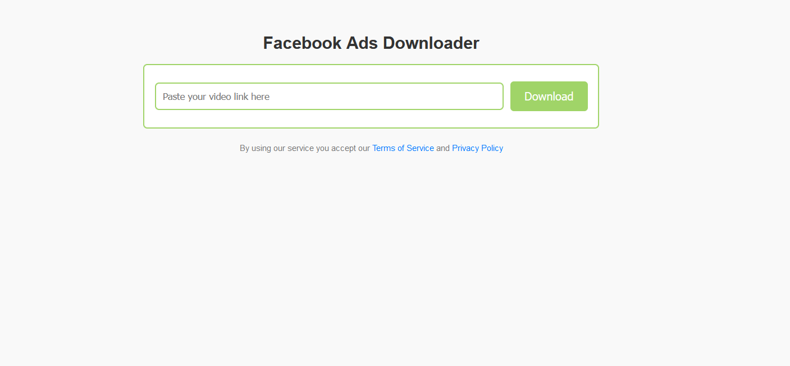

# Facebook Ads Video Downloader

This Django-based web application allows users to download videos from Facebook's Ads Library. Simply provide the link to the ad, and the app will handle the rest. The application offers seamless video downloading from the Facebook Ads Library with clear error handling and feedback to users.

## Features
- **Facebook Ad Video Downloads:** Easily download videos from the Facebook Ads Library using a headless Chrome browser.

## Installation

Clone the repository:
```bash
git clone https://github.com/your-repo/facebook-ads-video-downloader.git
cd facebook-ads-video-downloader
```


Install dependencies: Make sure you have Python and pip installed. Install the required packages by running:

```bash

pip install -r requirements.txt

```


Set up the Django project: Run the following commands to set up the database and start the server:

```bash

python manage.py migrate
python manage.py runserver
```

## Usage

Navigate to the homepage: Open your browser and go to http://localhost:8000.

Download Videos: Enter the URL of the Facebook ad you want to download, and the app will automatically process and download the video for you.




## Debugging and Logging

The app prints debug information to the console for troubleshooting. In case of errors, it returns appropriate messages to the user and logs the details.

